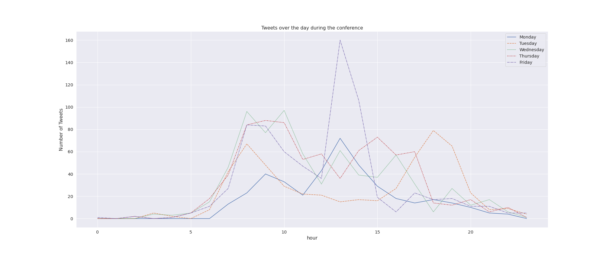

# „Kulturen des digitalen Gedächtnisses“ – DHd Conference 2022 #

From the 7th to the 11th march the annual DHd conference 2022 took place. Because of the Covid-19 pandemic, the 
conference was held via Zoom. Sitting at home the participants were connected to each other not only via ZOOM or gather-
town, but also via [Twitter](https://twitter.com/DHd2022).  
This left us with more than 3500 Tweets from 664 users between the 17th of February and the 18th March 2022. You find an
analyse and presentation of the tweets in the
[Jupyter-Notebook](https://github.com/Leano1998/DHd2022/blob/main/Twitter_DHd2022.ipynb).
